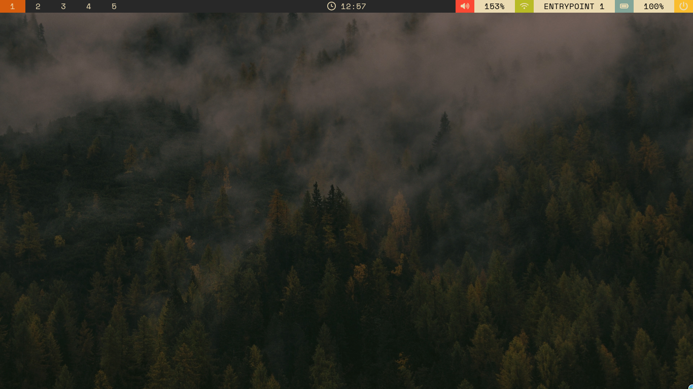
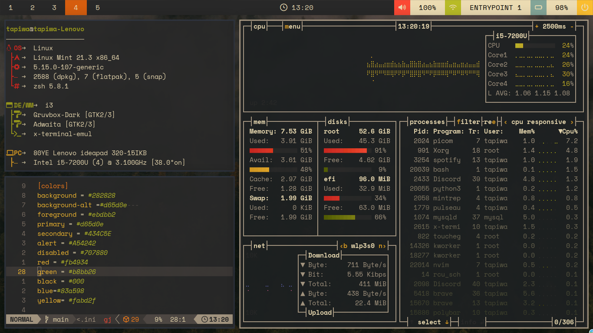
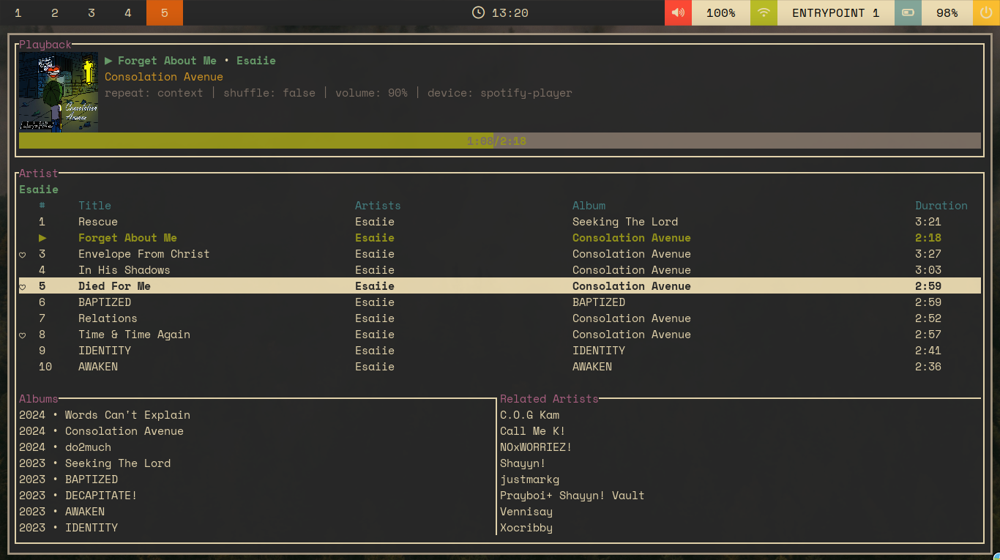

# dotfiles

Configuration files for my Arch Linux / Sway setup.

## Stack

| Component       | Tool                        |
|-----------------|-----------------------------|
| Compositor      | Sway                        |
| Bar             | Waybar                      |
| Widgets         | Eww                         |
| Notifications   | Mako                        |
| Launcher        | Rofi                        |
| Terminal        | Foot                        |
| Editor          | Neovim                      |
| Shell           | Zsh                         |

## Features

- Eww widgets: music player (Spotify via playerctl), control center with Wi-Fi, Bluetooth, DND, power profile, and disk usage
- Waybar: workspace indicator, mic status, battery, network, memory, VPN status
- Rofi-based Wi-Fi manager with signal strength, security icons, and connect/disconnect/forget support
- Screenshot tool: region select with slurp, auto-saved and copied to clipboard
- Power notifications via Mako on AC plug/unplug

## Dependencies

```
sway swaybg autotiling foot rofi mako eww waybar
playerctl spotify-player grim slurp wl-copy
nmcli bluetoothctl pactl tlp libnotify
JetBrainsMono Nerd Font
```

## Setup

```sh
git clone https://github.com/icep0ps/dotfiles ~/dotfiles
cd ~/dotfiles
stow --target="$HOME" .
```

## Screenshots




